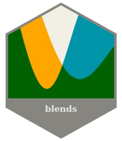

<!-- README.md is generated from README.Rmd. Please edit that file -->

```{r, include = FALSE}
knitr::opts_chunk$set(
  collapse = TRUE,
  comment = "#>",
  fig.path = "man/figures/README-",
  out.width = "100%"
)
```

# blends <a href="https://davidhodge931.github.io/blends/"></a>

<!-- badges: start -->
[](https://CRAN.R-project.org/package=blends)
<!-- badges: end -->

The objective of blends is to blend colours, palettes or palette functions using blend modes, such as multiply and screen.

## Installation

Install from CRAN, or development version from [GitHub](https://github.com/).

```r
install.packages("blends") 
pak::pak("davidhodge931/blends")
```

## Example

```{r setup, message=FALSE}
library(blends)
library(jumble)
scales::show_col(c(teal, orange, multiply(teal, orange)), ncol = 3)
```

```{r, echo = FALSE, message = FALSE, warning = FALSE}
plot_data <- tidyr::crossing(col1 = jumble::jumble, col2 = jumble::jumble) |>
  dplyr::rowwise() |>
  dplyr::mutate(
    multiply     = blends::multiply(col1, col2),
    screen       = blends::screen(col1, col2),
    darken       = blends::darken(col1, col2),
    lighten      = blends::lighten(col1, col2),
    overlay      = blends::overlay(col1, col2),
    hard_light   = blends::hard_light(col1, col2),
    soft_light   = blends::soft_light(col1, col2),
    colour_burn  = blends::colour_burn(col1, col2),
    colour_dodge = blends::colour_dodge(col1, col2),
    difference   = blends::difference(col1, col2),
    exclusion    = blends::exclusion(col1, col2)
  ) |>
  dplyr::ungroup() |>
  dplyr::mutate(row = dplyr::row_number())

blend_plot <- function(data, cols) {
  data |>
    tidyr::pivot_longer(-row, names_to = "name", values_to = "colour") |>
    dplyr::filter(name %in% cols) |>
    dplyr::mutate(
      name  = factor(name, levels = cols),
      group = factor(
        dplyr::if_else(name %in% c("col1", "col2"), "Input", "Blend Mode"),
        levels = c("Input", "Blend Mode")
      )
    ) |>
    ggplot2::ggplot(ggplot2::aes(x = name, y = -row, fill = colour)) +
    ggplot2::geom_tile(width = 0.9, height = 0.9) +
    ggplot2::scale_fill_identity() +
    ggplot2::scale_x_discrete(position = "top") +
    ggplot2::scale_y_continuous(expand = c(0, 0)) +
    ggplot2::facet_grid(
      cols   = ggplot2::vars(group),
      scales = "free_x",
      space  = "free_x"
    ) +
    ggplot2::theme_minimal() +
    ggplot2::theme(
      axis.text.x   = ggplot2::element_text(size = 11),
      axis.text.y   = ggplot2::element_blank(),
      axis.title    = ggplot2::element_blank(),
      panel.grid    = ggplot2::element_blank(),
      strip.text    = ggplot2::element_blank(),
      panel.spacing = ggplot2::unit(12, "pt")
    )
}
```
```{r, echo = FALSE, message = FALSE, warning = FALSE, fig.width = 10, fig.height = 10}
blend_plot(plot_data, c("col1", "col2", "multiply", "screen", "darken", "lighten"))
```
```{r, echo = FALSE, message = FALSE, warning = FALSE, fig.width = 10, fig.height = 10}
blend_plot(plot_data, c("col1", "col2", "overlay", "hard_light", "soft_light", "colour_burn", "colour_dodge", "difference", "exclusion"))
```

## Other packages

This package is part of a group of related packages built to extend [ggplot2](https://ggplot2.tidyverse.org).

<table>
  <tr>
    <td align="center" valign="top">
      <a href="https://davidhodge931.github.io/ggblanket">
        
      </a>
    </td>
    <td align="center" valign="top">
      <a href="https://davidhodge931.github.io/ggrefine">
        
      </a>
    </td>
    <td align="center" valign="top">
      <a href="https://davidhodge931.github.io/ggscribe">
        
      </a>
    </td>
  </tr>
  <tr>
    <td align="center" valign="top">
      <a href="https://davidhodge931.github.io/ggwidth">
        
      </a>
    </td>
    <td align="center" valign="top">
      <a href="https://davidhodge931.github.io/blends">
        
      </a>
    </td>
    <td align="center" valign="top">
      <a href="https://davidhodge931.github.io/jumble">
        
      </a>
    </td>
  </tr>
</table>
