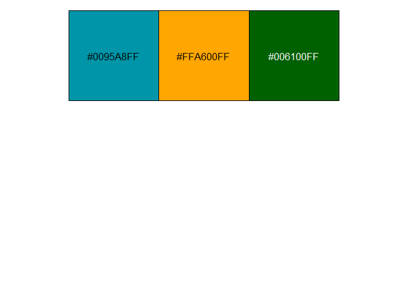
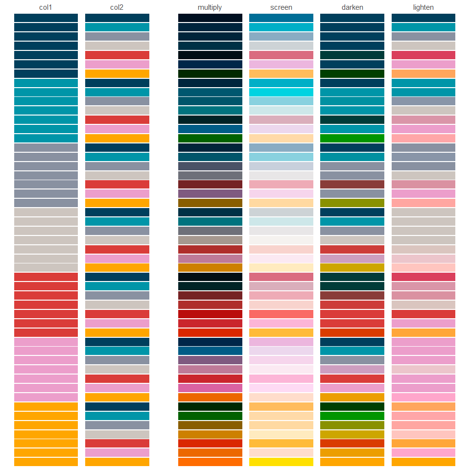
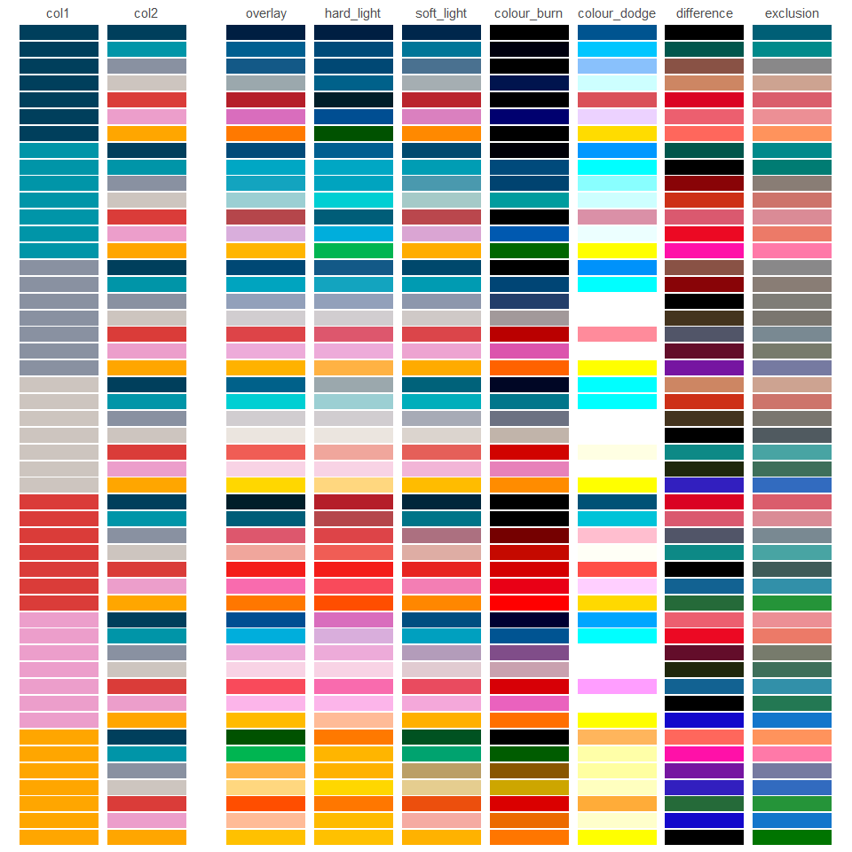

<!-- README.md is generated from README.Rmd. Please edit that file -->

# blends <a href="https://davidhodge931.github.io/blends/"></a>

<!-- badges: start -->

[](https://CRAN.R-project.org/package=blends)
<!-- badges: end -->

The objective of blends is to blend colour palettes using blend modes,
such as multiply and screen.

## Installation

Install from CRAN, or development version from
[GitHub](https://github.com/).

``` r
install.packages("blends") 
pak::pak("davidhodge931/blends")
```

## Example

``` r
library(dplyr)
library(jumble)

scales::show_col(c(teal, orange, blends::multiply(teal, orange)), ncol = 3)
```





